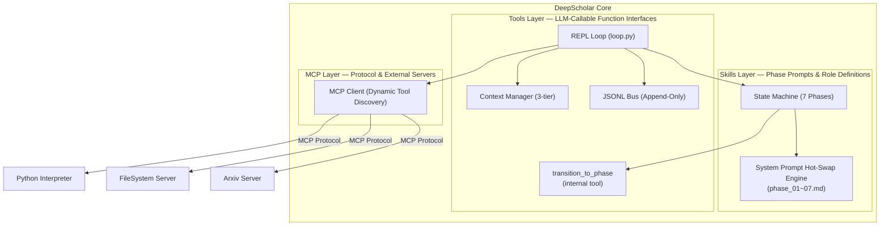

<div align="center">

[English](README.md) | [中文](README_CN.md)

# 🎓 DeepScholar

### An Autonomous Academic Research Agent

*From research question to published-ready paper — fully autonomous, fully traceable.*

[](https://python.org)
[](https://anthropic.com)
[](https://modelcontextprotocol.io)
[](LICENSE)
[](https://github.com/astral-sh/uv)

<br/>

> **DeepScholar** is a native LLM agent that autonomously conducts end-to-end academic research.
> No workflow graphs. No brittle pipelines. Just a clean REPL loop, an append-only message bus,
> and a state machine driven by the model itself.

<br/>

```
Research Topic ──► Literature Survey ──► Deep Reading ──► Argument Synthesis
                                                                    │
Paper Draft ◄── Result Analysis ◄── Experiment Execution ◄── Innovation Design
```

</div>

---

## ✨ What Makes This Different

Most "AI research tools" are sophisticated wrappers around a fixed pipeline — they break when reality doesn't match the happy path. **DeepScholar is built around how research actually works**: non-linear, iterative, and full of dead ends.

| Conventional AI Research Tools | DeepScholar |
|---|---|
| Fixed DAG / workflow graph | Self-paced `while` loop — the model decides when to move on |
| State lives in memory | Append-only JSONL bus — survives crashes, resumable anytime |
| Tools hardcoded into agent | MCP protocol — plug in any tool server at runtime |
| Context window explodes on paper 5 | Hierarchical context compression with workspace offloading |
| One monolithic persona | Dynamic system prompt swap per research phase |

---

## 🏗️ Architecture



> **Three-layer capability model**: **MCP** (protocol & external servers) → **Tools** (callable function interfaces for the LLM) → **Skills** (phase-specific prompts that define the agent's role and available tools at each stage).

### Core Design Principles

**1 — Native Agent, Zero Frameworks**
The entire agent lifecycle is a single Python `while` loop. No LangGraph, no LangChain, no AutoGen. The simplicity is the feature — you can read the entire orchestration logic in one file.

**2 — Append-Only JSONL Message Bus**
Every LLM response, every tool result, every phase transition is immediately flushed to a `.jsonl` file. Kill the process mid-experiment. Reboot the machine. The agent picks up exactly where it left off.

**3 — Model-Driven State Machine**
Research phases don't advance on a timer or a counter — the model calls `transition_to_phase()` when *it* decides the current phase is complete. This is the key to non-linear research behavior.

**4 — Three-Layer Capability Architecture (MCP / Tools / Skills)**
These three concepts are distinct and must not be conflated:
- **MCP** is the transport layer — it manages connections to external server processes and the protocol for discovering and calling their capabilities.
- **Tools** are the callable function interfaces exposed to the LLM via `tool_use`. Some are backed by MCP servers (e.g. `arxiv_search`), others are internal (e.g. `transition_to_phase`).
- **Skills** are the phase-specific system prompts (`phase_01~07.md`) that define the agent's role, workflow instructions, and tool permissions at each research stage.

---

## 🔬 Research Pipeline

DeepScholar autonomously navigates 7 research phases. Each phase has its own system prompt, tool permissions, and exit criteria determined by the model.

```
Phase 1 ── Survey          Search & map the research landscape (20–50 papers)
    │
Phase 2 ── Literature      Deep-read core papers, extract structured insights
    │
Phase 3 ── Arguments       Synthesize findings → identify research gaps → form thesis
    │
Phase 4 ── Innovation      Propose novel contributions + design experiments
    │
Phase 5 ── Experiment      Write code → run → debug → iterate autonomously
    │
Phase 6 ── Analysis        Statistical analysis, visualization, hypothesis validation
    │
Phase 7 ── Writing         Generate full LaTeX paper draft from accumulated artifacts
```

Each phase produces a **persistent artifact** in the workspace. No information is lost between phases.

```
workspace/runs/{run_id}/
├── history.jsonl                  # Complete agent memory (never deleted)
├── state.json                     # Current phase + metadata
└── artifacts/
    ├── survey_overview.md         # Phase 1 output
    ├── literature_review.md       # Phase 2 output
    ├── core_arguments.md          # Phase 3 output
    ├── experiment_design.md       # Phase 4 output
    ├── experiment_log.md          # Phase 5 output (append-only)
    ├── results.md                 # Phase 6 output
    ├── paper_draft.tex            # Phase 7 output
    └── figures/                   # Generated plots & visualizations
```

---

## 🧠 Context Management

Academic research is context-hungry. Reading 20 papers will fill any context window. DeepScholar uses a **three-tier defense**:

```
Tier 1 — Workspace Offloading (always active)
  Paper content → written to local .md files
  Agent uses read_file() to query on demand
  Nothing is kept in-context that can be on disk

Tier 2 — Soft Compression (at 70% token budget)
  Middle conversation history summarized by claude-haiku
  Head (initial task) + tail (recent 20 turns) preserved verbatim
  Compression ratio: ~10x with minimal information loss

Tier 3 — Hard Compression (at max_tokens)
  Aggressive middle-out compression
  Only critical context preserved
  Agent continues without interruption
```

---

## ⚡ Quick Start

### Prerequisites
- Python 3.11+
- [`uv`](https://github.com/astral-sh/uv) package manager
- Anthropic API key
- Node.js (for MCP filesystem server)

### Installation

```bash
git clone https://github.com/yourname/deepscholar
cd deepscholar
uv sync
cp .env.example .env   # add your ANTHROPIC_API_KEY
```

### Start a New Research Run

```bash
uv run python main.py --topic "Graph Neural Networks for Molecular Property Prediction"
```

### Resume an Interrupted Run

```bash
# The agent recovers full memory from history.jsonl
uv run python main.py --resume --run-id "run_20240414_143022"
```

### List All Runs

```bash
uv run python main.py --list-runs
```

---

## 🔌 MCP Server Ecosystem

MCP servers are the external processes that provide tool capabilities via the MCP protocol. Configure them in `mcp/servers.yaml` — the agent discovers all tools on startup.

| Server | Purpose | Install |
|--------|---------|---------|
| `arxiv-mcp-server` | Search & download Arxiv papers | `uvx arxiv-mcp-server` |
| `@modelcontextprotocol/server-filesystem` | Read/write workspace files | `npx` (bundled) |
| `mcp-server-python-repl` | Execute Python for experiments | `uvx mcp-server-python-repl` |
| `@modelcontextprotocol/server-brave-search` | Web search for context | `npx` + Brave API key |

**Adding a new tool server** is three lines in `servers.yaml` — no agent code changes needed.

---

## 🛠️ Key Implementation Details

### The Main Loop (simplified)

```python
while True:
    system_prompt = state_machine.get_current_system_prompt()
    tools = mcp.get_tools_for_phase(state_machine.current_phase)
    messages = ctx_manager.maybe_compress(messages, client)

    response = client.messages.create(
        model="claude-opus-4-6",
        system=system_prompt,
        messages=messages,
        tools=tools,
    )

    bus.append({"role": "assistant", "content": response.content})

    if response.stop_reason == "tool_use":
        for tool_call in response.content:
            if tool_call.name == "transition_to_phase":
                state_machine.transition(tool_call.input["target_phase"])
            else:
                result = mcp.call_tool(tool_call.name, tool_call.input)
                bus.append(tool_result(tool_call.id, result))
```

That's the entire orchestration engine. Every other file is infrastructure.

### Phase-Gated Tool Permissions (Skills → Tools)

Each **Skill** (phase prompt) controls which **Tools** the agent can access. An agent in the `literature` phase cannot call `execute_python`. An agent in `experiment` cannot call `arxiv_search`. This prevents capability leakage and keeps the model focused.

```python
PHASE_TOOL_PERMISSIONS = {
    "survey":     ["arxiv_search", "web_search", "write_file"],
    "literature": ["arxiv_search", "download_paper", "read_pdf", "write_file"],
    "experiment": ["execute_python", "read_file", "write_file"],
    "writing":    ["read_file", "write_file", "compile_latex"],
    # ...
}
```

### Crash Recovery

```
Run started ──► history.jsonl created
                     │
             [process killed mid-experiment]
                     │
uv run python main.py --resume --run-id xxx
                     │
             history.jsonl loaded (all 847 lines)
                     │
             state.json read → Phase: experiment
                     │
             Agent continues from exact interruption point
```

---

## 📊 Technical Stack

| Layer | Technology | Rationale |
|-------|-----------|-----------|
| LLM | Claude Opus 4.6 (main) + Haiku 4.5 (compression) | Best reasoning + cost efficiency |
| Orchestration | Native Python `while` loop | Zero abstraction overhead |
| Persistence | Append-only JSONL | Crash-safe, human-readable, diff-friendly |
| Tool Protocol | MCP (Model Context Protocol) | Decoupled, hot-swappable tool layer |
| Package Manager | uv | 10–100x faster than pip |
| PDF Parsing | PyMuPDF | Fast, accurate, no external dependencies |

---

## 🗺️ Roadmap

- [x] Core REPL loop with JSONL persistence
- [x] MCP client with dynamic tool discovery
- [x] 7-phase state machine with hot-swap system prompts
- [x] Three-tier context compression
- [ ] Web UI for run monitoring and artifact browsing
- [ ] Multi-agent mode (parallel literature review workers)
- [ ] LaTeX → PDF compilation pipeline
- [ ] Vector store integration for cross-run knowledge retrieval
- [ ] Benchmark: end-to-end paper generation quality evaluation

---

## 🧩 Design Philosophy

This project is a deliberate exercise in **minimum viable architecture for autonomous agents**.

The dominant trend in LLM engineering is to reach for frameworks — LangGraph for orchestration, vector stores for memory, complex middleware for tool calling. These abstractions solve real problems, but they also impose structure that fights against the inherently non-linear nature of real cognitive work.

DeepScholar's answer is to push responsibility *into the model*. The model decides when to advance phases. The model decides when context needs to be summarized. The model decides how to recover from failed experiments. The infrastructure just makes sure those decisions are recorded and executed faithfully.

The result is roughly 400 lines of orchestration code for an agent that can, in principle, write a publishable paper from a two-sentence prompt.

---

## 📄 License

MIT — see [LICENSE](LICENSE)

---

<div align="center">

**Built with curiosity about what autonomous research agents can actually do.**

*If you're reading this as a potential collaborator or employer —
the interesting part isn't the code, it's the architecture decisions and why they were made.
Happy to walk through any of it.*

</div>
