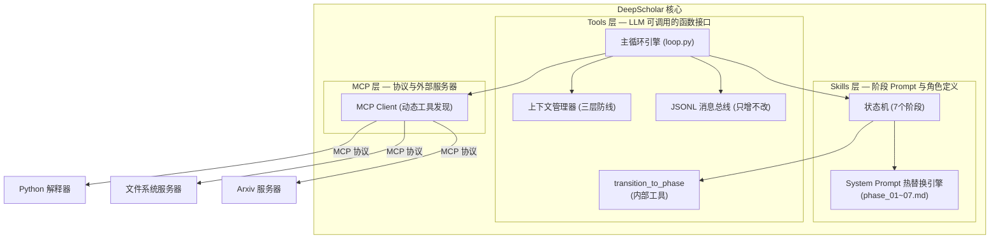

<div align="center">

[English](README.md) | [中文](README_CN.md)

# 🎓 DeepScholar

### 自主学术研究 Agent

*从研究课题到可投稿论文——全程自主，全程可溯源。*

[](https://python.org)
[](https://anthropic.com)
[](https://modelcontextprotocol.io)
[](LICENSE)
[](https://github.com/astral-sh/uv)

<br/>

> **DeepScholar** 是一个原生 LLM Agent，能够自主完成从课题调研到论文撰写的完整学术研究流程。
> 没有工作流图，没有脆弱的流水线。只有一个简洁的 REPL 循环、一条只增不改的消息总线，
> 以及一个由模型本身驱动的状态机。

<br/>

```
研究课题 ──► 文献调研 ──► 文献精读 ──► 核心论点提炼
                                              │
论文草稿 ◄── 结论分析 ◄── 实验执行 ◄── 理论创新设计
```

</div>

---

## ✨ 与众不同之处

市面上大多数"AI 研究工具"本质上是固定流水线的精美包装——一旦现实情况偏离预设路径就会失效。**DeepScholar 的构建逻辑来自真实科研的运作方式**：非线性、高度迭代、充满试错。

| 传统 AI 研究工具 | DeepScholar |
|---|---|
| 固定的 DAG / 工作流图 | 自主节奏的 `while` 循环——模型自己决定何时推进 |
| 状态存在于内存中 | 只增不改的 JSONL 总线——崩溃后随时恢复 |
| 工具硬编码在 Agent 中 | MCP 协议——运行时动态插拔工具服务器 |
| 读到第5篇论文就撑爆上下文 | 分层上下文压缩 + 工作区文件卸载 |
| 单一固定人设 | 每个研究阶段动态替换 System Prompt |

---

## 🏗️ 系统架构



> **三层能力模型**：**MCP**（协议与外部服务器）→ **Tools**（暴露给 LLM 的可调用函数接口）→ **Skills**（阶段 Prompt，定义 Agent 在每个阶段的角色与可用工具）。

### 核心设计原则

**原则一——原生 Agent，零框架依赖**
整个 Agent 的生命周期就是一个 Python `while` 循环。不用 LangGraph，不用 LangChain，不用 AutoGen。简洁本身就是功能——所有编排逻辑在一个文件里读完。

**原则二——只增不改的 JSONL 消息总线**
每一条 LLM 回复、每一次工具调用结果、每一次阶段切换，都会立即刷入 `.jsonl` 文件。实验中途 kill 进程，重启机器，Agent 从断点无缝续跑。

**原则三——模型驱动的状态机**
研究阶段的推进不靠计时器也不靠计数器——模型在**它认为**当前阶段已充分完成时，主动调用 `transition_to_phase()` 工具。这是实现非线性研究行为的关键。

**原则四——三层能力架构（MCP / Tools / Skills）**
这三个概念各自独立，不可混为一谈：
- **MCP** 是传输层——管理与外部服务器进程的连接，以及工具发现和调用的协议。
- **Tools** 是函数接口层——通过 `tool_use` 暴露给 LLM 的可调用函数。有些由 MCP Server 提供（如 `arxiv_search`），有些是内部实现的（如 `transition_to_phase`）。
- **Skills** 是策略层——阶段专属的 System Prompt（`phase_01~07.md`），定义 Agent 在每个研究阶段的角色、工作流指令和工具权限。

---

## 🔬 完整研究流程

DeepScholar 自主导航 7 个研究阶段。每个阶段有独立的 System Prompt、工具权限和由模型判断的退出条件。

```
阶段 1 ── 选题调研     搜索并绘制研究领域全景图（20~50 篇论文）
    │
阶段 2 ── 文献精读     深度阅读核心论文，提取结构化洞察
    │
阶段 3 ── 论点提炼     综合发现 → 识别研究空白 → 形成论点
    │
阶段 4 ── 理论创新     提出原创贡献点 + 设计实验方案
    │
阶段 5 ── 实验执行     编写代码 → 运行 → 自主调试 → 迭代
    │
阶段 6 ── 结论分析     统计分析、可视化、假设验证
    │
阶段 7 ── 论文撰写     从累积的产出文件生成完整 LaTeX 论文草稿
```

每个阶段都会在工作区生成一个**持久化产出文件**，阶段间信息零损耗。

```
workspace/runs/{run_id}/
├── history.jsonl                  # Agent 完整记忆（永不删除）
├── state.json                     # 当前阶段 + 元数据
└── artifacts/
    ├── survey_overview.md         # 阶段 1 产出：领域调研报告
    ├── literature_review.md       # 阶段 2 产出：文献综述
    ├── core_arguments.md          # 阶段 3 产出：核心论点
    ├── experiment_design.md       # 阶段 4 产出：实验设计
    ├── experiment_log.md          # 阶段 5 产出：实验日志（追加）
    ├── results.md                 # 阶段 6 产出：结论分析
    ├── paper_draft.tex            # 阶段 7 产出：论文草稿
    └── figures/                   # 生成的图表与可视化
```

---

## 🧠 上下文管理

学术研究极其消耗上下文。读 20 篇论文会轻易撑爆任何模型的 context window。DeepScholar 采用**三层防线**：

```
第一层 ── 工作区文件卸载（始终生效）
  论文内容 → 写入本地 .md 文件
  Agent 通过 read_file() 按需查询
  能放磁盘的内容绝不留在上下文里

第二层 ── 软压缩（达到 Token 预算 70% 时触发）
  中间对话历史交由 claude-haiku 总结压缩
  头部（初始任务）+ 尾部（近 20 轮）原文保留
  压缩比约 10:1，关键信息零丢失

第三层 ── 强制压缩（达到 max_tokens 时触发）
  激进的中间折叠压缩
  只保留最关键的上下文
  Agent 不中断，继续运行
```

---

## ⚡ 快速开始

### 环境要求
- Python 3.11+
- [`uv`](https://github.com/astral-sh/uv) 包管理器
- Anthropic API Key
- Node.js（用于 MCP 文件系统服务器）

### 安装

```bash
git clone https://github.com/yourname/deepscholar
cd deepscholar
uv sync
cp .env.example .env   # 填入你的 ANTHROPIC_API_KEY
```

### 启动新的研究任务

```bash
uv run python main.py --topic "基于图神经网络的药物分子性质预测"
```

### 恢复中断的研究

```bash
# Agent 从 history.jsonl 完整恢复记忆，从断点继续
uv run python main.py --resume --run-id "run_20240414_143022"
```

### 查看所有历史 Run

```bash
uv run python main.py --list-runs
```

---

## 🔌 MCP 服务器生态

MCP 服务器是通过 MCP 协议提供工具能力的外部进程。在 `mcp/servers.yaml` 中配置，Agent 启动时自动发现所有工具。

| 服务器 | 用途 | 安装方式 |
|--------|------|---------|
| `arxiv-mcp-server` | 搜索与下载 Arxiv 论文 | `uvx arxiv-mcp-server` |
| `@modelcontextprotocol/server-filesystem` | 读写工作区文件 | `npx`（已内置） |
| `mcp-server-python-repl` | 执行实验 Python 代码 | `uvx mcp-server-python-repl` |
| `@modelcontextprotocol/server-brave-search` | 网络搜索补充 | `npx` + Brave API Key |

**新增工具服务器**只需在 `servers.yaml` 里加三行配置，无需修改任何 Agent 代码。

---

## 🛠️ 核心实现细节

### 主循环（精简版）

```python
while True:
    system_prompt = state_machine.get_current_system_prompt()
    tools = mcp.get_tools_for_phase(state_machine.current_phase)
    messages = ctx_manager.maybe_compress(messages, client)

    response = client.messages.create(
        model="claude-opus-4-6",
        system=system_prompt,
        messages=messages,
        tools=tools,
    )

    bus.append({"role": "assistant", "content": response.content})

    if response.stop_reason == "tool_use":
        for tool_call in response.content:
            if tool_call.name == "transition_to_phase":
                state_machine.transition(tool_call.input["target_phase"])
            else:
                result = mcp.call_tool(tool_call.name, tool_call.input)
                bus.append(tool_result(tool_call.id, result))
```

这就是整个编排引擎的全部。其他所有文件都是基础设施。

### 阶段权限隔离（Skills → Tools）

每个 **Skill**（阶段 Prompt）控制 Agent 能使用哪些 **Tools**。处于文献精读阶段时无法调用 `execute_python`，处于实验阶段时无法调用 `arxiv_search`。这防止了能力泄漏，让模型保持专注。

```python
PHASE_TOOL_PERMISSIONS = {
    "survey":     ["arxiv_search", "web_search", "write_file"],
    "literature": ["arxiv_search", "download_paper", "read_pdf", "write_file"],
    "experiment": ["execute_python", "read_file", "write_file"],
    "writing":    ["read_file", "write_file", "compile_latex"],
    # ...
}
```

### 崩溃恢复流程

```
任务启动 ──► history.jsonl 创建
                    │
          [实验进行中，进程被 kill]
                    │
uv run python main.py --resume --run-id xxx
                    │
          history.jsonl 加载（全部 847 行）
                    │
          state.json 读取 → 当前阶段：experiment
                    │
          Agent 从精确断点继续执行
```

---

## 📊 技术选型

| 层次 | 技术选择 | 选型理由 |
|------|---------|---------|
| 大语言模型 | Claude Opus 4.6（主力）+ Haiku 4.5（压缩） | 最强推理能力 + 成本效率平衡 |
| 任务编排 | 原生 Python `while` 循环 | 零抽象开销，完全可控 |
| 持久化 | 只增不改 JSONL | 崩溃安全、人类可读、易于 diff |
| 工具协议 | MCP（模型上下文协议） | 工具与 Agent 完全解耦，可热插拔 |
| 包管理 | uv | 比 pip 快 10~100 倍 |
| PDF 解析 | PyMuPDF | 快速、精准，无外部依赖 |

---

## 🗺️ 开发路线图

- [x] 核心 REPL 循环 + JSONL 持久化
- [x] MCP Client 动态工具发现
- [x] 7 阶段状态机 + System Prompt 热替换
- [x] 三层上下文压缩策略
- [ ] Web UI：Run 监控与产出文件浏览
- [ ] 多 Agent 并行模式（文献调研并行化）
- [ ] LaTeX → PDF 编译流水线
- [ ] 向量库集成：跨 Run 知识检索
- [ ] 端到端论文生成质量 Benchmark

---

## 🧩 设计哲学

这个项目是对一个问题的刻意探索：**自主 Agent 的最小可行架构应该长什么样？**

LLM 工程领域的主流趋势是伸手去拿框架——用 LangGraph 编排，用向量库记忆，用复杂中间件处理工具调用。这些抽象解决了真实问题，但也强加了与真实认知工作（本质上是非线性的）相互对抗的结构。

DeepScholar 的答案是：**把责任压回模型内部**。由模型决定何时推进阶段，由模型决定何时压缩上下文，由模型决定如何从失败实验中恢复。基础设施只需确保这些决策被如实记录和执行。

结果是大约 400 行编排代码，驱动一个能够从两句话的提示词出发、写出一篇完整论文草稿的 Agent。

---

## 📄 许可证

MIT — 详见 [LICENSE](LICENSE)

---

<div align="center">

**出于对自主研究 Agent 真正能做到什么的好奇心而构建。**

*如果你作为潜在的合作者或面试官在阅读这篇文档——*
*有趣的地方不在代码本身，而在架构决策以及背后的原因。*
*欢迎深入交流任何细节。*

</div>
